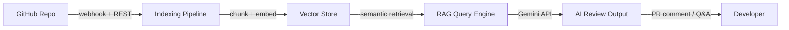

# OwnYourCode AI

**Your codebase, understood.**

[](https://nextjs.org/)
[](https://trpc.io/)
[](https://prisma.io/)
[](https://tailwindcss.com/)
[](https://neon.tech/)
[](https://ai.google.dev/)

---

Connect your GitHub repository and start asking questions about your code. Our AI indexes your codebase, answers questions about any file or function, and reviews every pull request automatically — grounded entirely in your actual code, not a generic model's assumptions. It works across any repo size, supports private repositories, and stores none of your code after indexing.

---

## Architecture



---

## Tech Stack

| Layer | Technologies |
|---|---|
| **Frontend** | Next.js 15, Tailwind CSS, shadcn/ui |
| **API** | tRPC, Next.js App Router |
| **Auth** | Clerk |
| **Database** | PostgreSQL (Neon), Prisma ORM |
| **AI** | Google Gemini, Langchain.js |
| **Storage** | Firestore (embeddings) |

---

## Quick Start

### 1. Clone

```bash
git clone https://github.com/yourusername/ownyourcode-ai.git
cd ownyourcode-ai
```

### 2. Install dependencies

```bash
npm install
```

### 3. Configure environment

```bash
cp .env.example .env
```

Fill in your API keys. See `.env.example` for required variables.

### 4. Set up the database

```bash
npx prisma db push
```

### 5. Run the dev server

```bash
npm run dev
```

Open [http://localhost:3000](http://localhost:3000).

---

## Deployment

Pre-configured for [Vercel](https://vercel.com). Set the same environment variables from `.env` in your Vercel project settings, then deploy.

[](https://vercel.com/new)
