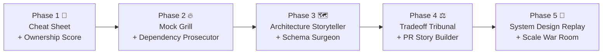

# 🎯 Synthia Interview Prep — Feature Blueprint

> **Mission:** Turn every "vibe-coded" project into a story you can defend under pressure.

---

## The Problem in 2026

It's never been easier to *build* software — and never been harder to *explain* it. With AI-assisted development ("vibe coding") powering 90 % of résumé projects, interviewers have adapted: they skip "tell me what you built" and go straight to **"tell me *why* you built it that way."**

Candidates freeze. They can't explain their own schema design, justify their dependency choices, or walk through the architecture they shipped. **The gap between building and understanding is the #1 reason technical interviews fail today.**

**Synthia bridges that gap.** We already index and understand entire codebases. Now we turn that understanding into *interview fluency* — so candidates can speak about their projects with the depth and confidence of someone who wrote every line by hand.

---

## 🏗️ Feature Overview

| # | Feature | Core Value |
|---|---------|------------|
| 1 | 🔥 Mock Grill Mode | Realistic AI cross-examination |
| 2 | 🗺️ Architecture Storyteller | Visual system design walkthroughs |
| 3 | 📦 Dependency Prosecutor | Deep-dive into every `import` |
| 4 | 🗄️ Schema Surgeon | Database design interrogation |
| 5 | ⚖️ Tradeoff Tribunal | Decision-level "why not X?" drills |
| 6 | 📊 Code Ownership Score | Quantify how well you know your code |
| 7 | 🧩 System Design Replay | Re-derive your architecture from scratch |
| 8 | 📜 PR Story Builder | Turn git history into interview narratives |
| 9 | 🚀 Scale & Performance War Room | Perf & scalability cross-questions |
| 10 | 📋 Pre-Interview Cheat Sheet | One-page briefing before the call |

---

## Feature Details

---

### 1. 🔥 Mock Grill Mode

**Problem it solves**
Candidates don't know what hard questions *feel* like until they're in the interview. There's no safe place to practice defending technical decisions under realistic pressure.

**How it works**
After indexing a repo, the user enters "Mock Grill" — a timed, voice-or-chat session where an AI interviewer asks progressively harder questions about the codebase. The AI reads the actual code, detects weak spots (unused error handling, copy-pasted logic, oddly-chosen libraries), and probes them specifically. Each answer is scored on **depth**, **accuracy**, and **confidence**. At the end, the user receives a detailed scorecard with per-topic ratings and suggested study areas. Sessions can be configured by difficulty (Junior / Mid / Senior / Staff) and interviewer persona (friendly, neutral, adversarial).

**Example interview question it prepares for**
> *"I see you're using Redis here for caching. Walk me through your cache invalidation strategy — what happens when underlying data changes?"*

**Monetization angle**
Free tier: 2 mock sessions per repo per month. **Pro ($12/mo):** Unlimited sessions, advanced personas, voice mode, and downloadable session transcripts. **Team ($25/seat/mo):** Managers can review candidate scorecards.

---

### 2. 🗺️ Architecture Storyteller

**Problem it solves**
"Walk me through your system design" is the most common — and most dreaded — interview question. Most candidates can't articulate their own architecture clearly because they never drew the full picture themselves.

**How it works**
Synthia statically analyzes the repo's module boundaries, API routes, service layers, database connections, message queues, and external integrations. It auto-generates an interactive architecture diagram (using Mermaid / D3.js) with annotated data-flow arrows. The user can click any component to see a plain-English explanation of its role and how it connects to everything else. A "Narrate" button generates a scripted 2-minute walkthrough the user can rehearse — complete with transitions like *"When a request hits the API gateway, the first thing that happens is…"*. Users can customize the diagram to match what they'd draw on a whiteboard.

**Example interview question it prepares for**
> *"Can you draw your system architecture on the whiteboard and walk me through a typical user request, end to end?"*

**Monetization angle**
Free tier: Static diagram only. **Pro:** Interactive exploration, narration scripts, exportable SVG/PNG for portfolio use, and "whiteboard rehearsal" mode that hides labels so users can practice from memory.

---

### 3. 📦 Dependency Prosecutor

**Problem it solves**
Interviewers love asking "Why did you choose X over Y?" for every major dependency. Candidates who vibe-coded their projects often can't answer because *they* didn't choose the library — the AI did.

**How it works**
Synthia parses `package.json`, `requirements.txt`, `go.mod`, `Cargo.toml`, etc. and identifies every non-trivial dependency. For each one, it researches alternatives (e.g., *Express vs. Fastify vs. Hono*, *SQLAlchemy vs. Tortoise ORM*), generates a comparison matrix (performance, community size, learning curve, bundle size), and produces a "defense brief" — a 3-sentence justification the user can memorize. It also flags dependencies the user likely can't explain (e.g., transitive deps pulled in by a framework) and teaches the user what they do. A flashcard-style quiz drills retention.

**Example interview question it prepares for**
> *"I see you used Zustand for state management. Why not Redux or Jotai? What specifically about Zustand fit your use case?"*

**Monetization angle**
Free tier: Top 5 dependencies analyzed. **Pro:** Full dependency tree analysis, comparison matrices, exportable defense briefs, and weekly "pop quiz" emails on your stack.

---

### 4. 🗄️ Schema Surgeon

**Problem it solves**
Database design questions expose whether a candidate truly understands data modeling or just copied a schema from a tutorial. Most candidates can't explain their indexing strategy, normalization choices, or relationship cardinalities.

**How it works**
Synthia detects ORM models, raw SQL migrations, or schema files in the repo. It reconstructs the full ER diagram, annotating each table with its purpose, relationships (1:1, 1:N, M:N), and indexing strategy. It then generates a "challenge deck" of questions: *Why is this a separate table instead of a JSON column? Why didn't you denormalize here? What happens to this join at 10M rows?* The user answers each question, and the AI evaluates the response against best practices and the actual schema context. It also suggests schema improvements the user can mention proactively in interviews ("One thing I'd change if I did it again is…").

**Example interview question it prepares for**
> *"Explain your database schema. Why do you have a separate `addresses` table instead of embedding the address in the `users` table? What were the tradeoffs?"*

**Monetization angle**
Free tier: ER diagram + 3 challenge questions. **Pro:** Full challenge deck (15-20 questions), improvement suggestions, and "schema defense script" — a rehearsable narrative for explaining the entire data model.

---

### 5. ⚖️ Tradeoff Tribunal

**Problem it solves**
Senior-level interviews are all about tradeoffs: *consistency vs. availability, speed vs. correctness, simplicity vs. extensibility*. Candidates need to articulate the specific tradeoffs in *their* project, not just recite textbook definitions.

**How it works**
Synthia performs deep code analysis to surface real architectural decisions and their tradeoffs. For example: "You chose server-side rendering — tradeoff: better SEO but higher server costs." Or: "You used a monorepo — tradeoff: unified versioning but slower CI." Each detected tradeoff is presented as a flashcard with the **decision**, the **alternative**, the **pro**, and the **con**. The user can practice articulating each tradeoff aloud (with speech-to-text scoring) or in writing. The AI also generates "devil's advocate" follow-ups: *"But couldn't you have gotten the same SEO benefit with pre-rendering?"*

**Example interview question it prepares for**
> *"Why did you go with a REST API instead of GraphQL? What tradeoffs did you consider?"*

**Monetization angle**
Free tier: Top 3 tradeoffs identified. **Pro:** Exhaustive tradeoff map, devil's advocate mode, and "tradeoff storytelling" — where the AI helps the user weave tradeoffs into a compelling narrative about engineering maturity.

---

### 6. 📊 Code Ownership Score

**Problem it solves**
Candidates don't know *which parts* of their own codebase they understand well and which parts they'd stumble on if asked. They need a self-awareness tool before walking into an interview.

**How it works**
Synthia presents the user with a series of rapid-fire micro-questions about different modules, files, and functions in their repo (e.g., *"What does `middleware/auth.js` do?" "What triggers the `syncQueue` function?"*). Based on response speed and accuracy, it builds a heat map of the codebase — green for well-understood areas, yellow for shaky, red for blind spots. The heat map updates over time as the user studies. Users can drill into red zones to get explanations and then re-test. A global "Ownership Score" (0-100) gives a single number the user can track as they prepare.

**Example interview question it prepares for**
> *"Tell me about the authentication flow in your project. How does session management work?"*

**Monetization angle**
Free tier: Score for 1 repo, basic heat map. **Pro:** Unlimited repos, granular heat map down to function level, trend tracking over time, and "interview readiness" badge the user can share on LinkedIn.

---

### 7. 🧩 System Design Replay

**Problem it solves**
The ultimate test of understanding is whether you can *re-derive* your own architecture from requirements. If an interviewer says "Let's design this from scratch," you should be able to walk through the same decisions you (or your AI) made — and explain each one.

**How it works**
Synthia extracts the core requirements your project fulfills (e.g., "real-time chat with read receipts, media upload, user presence"). It then starts a guided system design session: *"You need to support real-time messaging. What protocol would you use and why?"* The user answers, and the AI compares their answer to what's actually in the codebase. If the user says "WebSockets" but the code uses SSE, the AI highlights the discrepancy and teaches the user *why* SSE was used. By the end, the user has rebuilt their own architecture from first principles and can explain every layer.

**Example interview question it prepares for**
> *"Let's say we're building this from scratch. How would you design the notification system? Walk me through your approach."*

**Monetization angle**
Free tier: 1 replay session per repo. **Pro:** Unlimited replays, branching paths ("What if you had to support 10x the users?"), and exportable design documents the user can reference.

---

### 8. 📜 PR Story Builder

**Problem it solves**
Interviewers increasingly ask *behavioral-technical* questions: "Tell me about a hard bug you fixed" or "Describe a time you refactored something significant." Candidates struggle to recall specific examples with enough technical detail.

**How it works**
Synthia analyzes the git history — commit messages, PR descriptions, diffs, and file-change patterns — to identify "story-worthy" moments: large refactors, bug fixes, performance improvements, feature launches, and architecture changes. For each one, it generates a structured **STAR narrative** (Situation, Task, Action, Result) enriched with actual code diffs and metrics. The user can rehearse each story and the AI asks follow-up questions an interviewer would ask. Stories are tagged by theme (debugging, performance, collaboration, architecture) so users can quickly pull the right one during an interview.

**Example interview question it prepares for**
> *"Tell me about the most challenging technical problem you solved in this project. How did you debug it?"*

**Monetization angle**
Free tier: Top 3 auto-detected stories. **Pro:** Full story library, STAR narrative refinement, and "story bank" across multiple repos for candidates with several projects on their résumé.

---

### 9. 🚀 Scale & Performance War Room

**Problem it solves**
"How would this scale?" is the question that separates mid-level from senior candidates. Most vibe-coded projects were never designed for scale, and candidates can't discuss bottlenecks, caching strategies, or load patterns.

**How it works**
Synthia performs a simulated "scale audit" of the codebase: it identifies N+1 queries, missing indexes, synchronous bottlenecks, unoptimized assets, lack of pagination, absence of rate limiting, and other scalability red flags. For each issue, it generates an interview-ready explanation: what the bottleneck is, why it matters at scale, and how the user would fix it. It also creates a "What if?" drill: *"Your app now has 100K concurrent users. What breaks first?"* The user walks through the failure cascade and practices articulating a scaling plan.

**Example interview question it prepares for**
> *"This endpoint does a database join across three tables. What happens when you have a million users? How would you optimize it?"*

**Monetization angle**
Free tier: Top 3 scalability issues flagged. **Pro:** Full audit report, "What if?" interactive drills, and comparison against industry benchmarks (e.g., "Apps at your scale typically use connection pooling — here's why").

---

### 10. 📋 Pre-Interview Cheat Sheet

**Problem it solves**
The night before an interview, candidates need a single, scannable document that refreshes their memory on everything important about their project. Currently, they scramble through code, READMEs, and notes.

**How it works**
With one click, Synthia generates a beautifully formatted, one-page (or scrollable) cheat sheet for a specific repo. It includes: **Tech Stack Summary** (every major dependency with a one-liner on *why*), **Architecture Overview** (simplified diagram + 3-sentence narration), **Top 5 Talking Points** (most impressive/complex parts of the project), **Known Weaknesses** (things to proactively address before the interviewer finds them), **Key Metrics** (lines of code, number of endpoints, DB tables, test coverage), and **Likely Questions** (the 10 most probable questions an interviewer would ask about this specific codebase, with suggested answers). The sheet is exportable as PDF and can be printed or viewed on a phone during a commute.

**Example interview question it prepares for**
> *"Give me a high-level overview of this project — the tech stack, the architecture, and what you're most proud of."*

**Monetization angle**
Free tier: Basic cheat sheet (stack + overview). **Pro:** Full cheat sheet with talking points, weakness coaching, predicted questions with model answers, and "quick refresh" audio version the user can listen to on the way to the interview.

---

## 💰 Monetization Summary

| Tier | Price | Includes |
|------|-------|----------|
| **Free** | $0 | Basic versions of all features, 1 repo, limited sessions |
| **Pro** | $12/mo | Full access to all features, unlimited repos, export & audio |
| **Team** | $25/seat/mo | Everything in Pro + manager dashboards, team scorecards, onboarding prep |
| **Enterprise** | Custom | SSO, custom interviewer personas, integration with ATS/HRIS, bulk licensing for bootcamps & universities |

---

## 🧭 Strategic Positioning

```
Traditional Interview Prep          Synthia Interview Prep
─────────────────────────          ─────────────────────────
Generic LeetCode problems    →     YOUR actual codebase
Memorize textbook answers    →     Understand YOUR decisions
Practice with strangers      →     AI that knows YOUR code
One-size-fits-all            →     Personalized to YOUR project
```

> **Tagline idea:** *"Don't just build it. Own it."*

---

## 🚦 Recommended Build Order



**Phase 1** ships fastest (mostly leveraging existing indexing) and provides immediate value. **Phase 2** is the viral hook (Mock Grill is demo-able and shareable). **Phases 3-5** build the moat for retention and premium conversion.

---

> [!IMPORTANT]
> All 10 features are powered by the **same core infrastructure** — codebase indexing + AI reasoning — that Synthia already has. The pivot is primarily a **UX and prompt-engineering effort**, not a ground-up rebuild. This is why we can move fast.

---

*Document prepared by Agent 3 — Interview Prep Features Ideation · May 28, 2026*
